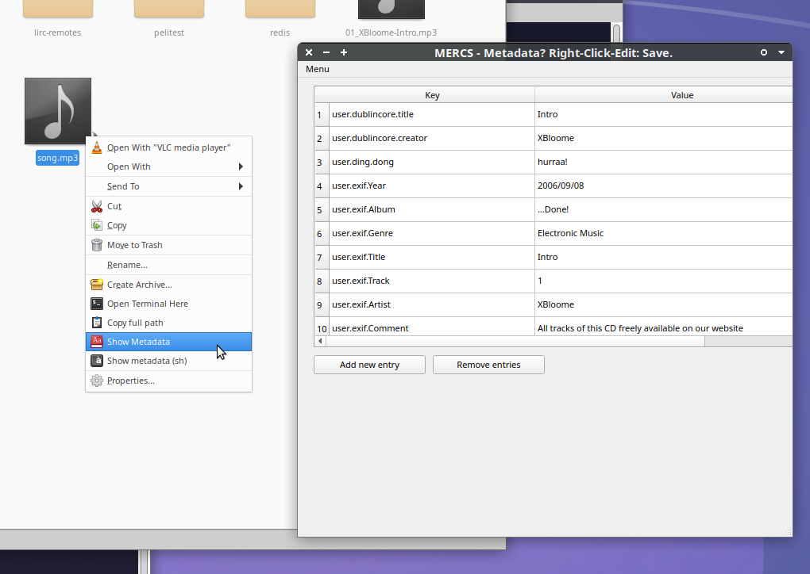

# AHAlodeck

Welcome! :)

# A Holodeck by August.

Here we're building a very simple, yet powerful environment that can digest "Meta+Data Objects" in clever ways.
Based on already existing FOSS components that we try to orchestrate to each other.

**And simply make use of "name=value" tags in the filesystem (where filename and path are stored); and using that filesystem directly as database.**

And it's as accessible and easy as "simply putting a letter in a filename/path"

The following image is a screenshot of a prototype setup:
It shows a 0-Byte "file" being tagged to contain references to "other Objects".
And that 0-Byte file having a title itself: Fully performing as a database entry.

--------------------------------

TL;DR:

> If I'm correct, then I may introduce a change for anyone dealing with digital data, **comparable to going beyond 8.3 uppercase-only ASCII characters in a filename (1995), to Object Oriented programming and responsive design**: Using common, existing filesystem features. 😄️

It is incredibly simple and feels very useful already in early prototype components.

**Just imagine being able to "tag" (somekey=somevalue) any file and folder:  
Right-Click-Edit-Metadata.**

What I am suggesting is to use existing FOSS-licensed technologies designed for storing and managing modern (even big) data. And really letting go of files-in-folders with excel sheets and incompatible databases and embedded metadata to a data-design and handling, making use of proper Object Storage environment's capabilities.

  * Simply, putting metadata with the data: Where it belongs.
  * And draw relationships right with others of those same "Meta+Data Objects".
  * And support (de)referencing any kind of "link" information.

Even supporting torrent magnet-links for options like having light-or-heavy Data Object manifestations.
On the fly. ;)

## More?

Welcome.

This is ongoing research-and-development.

In fact, we're mainly starting with using xattrs and plan to patch existing code to provide on-board features for working with seriously-used "xattrs" - and going Object Storage, Swift, Apache Iceberg, Sparql, Recoll, etc.

# Why?

If you have good answers to the questions asked in the following image, please let us know:

If your job is to care-or-know where which of what metadata goes with what "Object" where - and why: And where it is all stored and accessed digitally, you've come to the right place. This is what we're trying to finally make it fun again.

