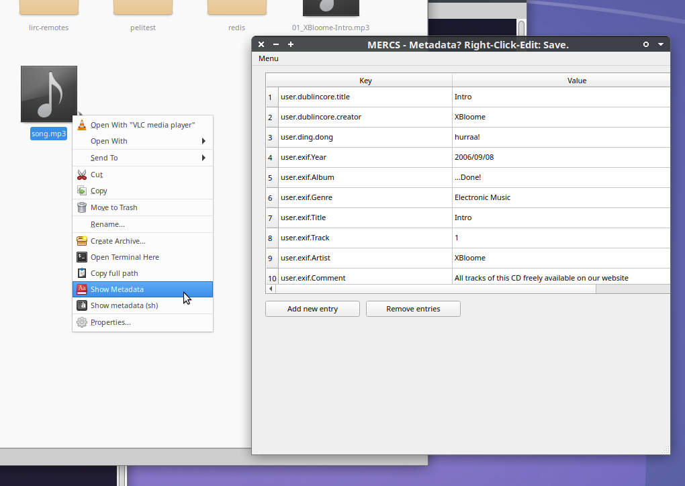

# FAQs

# xattrs, yeah... right: refresh my memory. What /is/ it you're talking about? Ex-what?

    Extended attributes, are key/value metadata information stored in the
    filesystem with your data (right with the data object. like the filename or
    path).

    This allows storing information that one usually would love to put in the
    filename or path, like "title", "creator", "artist", "webpage", "tags", etc -
    can be stored on any kind of filesystem object.

    Like all MP3/Movie/Image annotation- and technical-metadata, including
    hyperlinks, can be stored directly with the data.  Independent of the
    file-format used inside the file object. That is the beauty of `xattrs`.

    And this is not a hack: `xattrs` are [an open (POSIX)
    standard](https://lwn.net/Articles/868505/), and stable as in "this is the
    engine used for SE (Secure Enterprise) Linux ACLs (Access Control Lists)",
    and are used on Linux and MacOS since 1995.

    Which is sysadmin-speak for: `xattrs` are designed and supported to be used for reliable key/value store of metadata.
    So yes, let's use them. Professionally and personally.
    It even works on [Android (F2FS)](https://github.com/ArkThis/AHAlodeck/discussions/8).

# Which filesystem(s) are we talking about?

    Who can do `xattrs`?

  # Most Linux (POSIX compliant?) filesystems, and library implementations written after 2006 (or earliest ~1995).
  # MacOS even includes proper xattr-support in their new filesystem APFS, and have them in HFS since back in the 90s, too.
  # Windows can theoretically do something similar to `xattrs`, but most programming libraries for xattrs seem to support mostly/only Linux and MacOS.

    Meaning:

  # Linux: ext4, ZFS, btrfs, xfs, f2fs, orangeFS, etc...
  # MacOS: HFS, APFS

    So on Linux and MacOS, xattrs work pretty much out-of-the-box on their default filesystems.

# Why did you highlight "ZFS" in the list of xattr-friendly filesystems?

    Thanks for noticing!
    Indeed, my current favorite after testing and converting all kinds of
    real-life metadata to `xattrs`, ZFS on Linux offers the largest address space
    for attributes: 64kB per value (AFAIK).

    And the features that ZFS provides as filesystem (snapshots, integrity
    checking, data-pools, etc) are invaluable as underlying functionalities when
    going towards modern computing storage "needs".

    The MacOS filesystems are said to have unlimited `xattrs`, with spawning inodes if requiring more space.
    I believe they work flawlessly on MacOS, and they seem to be used actively by the OS itself.
    I'd love to use HFS/APFS on Linux for `xattrs`, but...

    ...due to "compatibility and license" issues (I guess?), HFS/APFS support
    on Linux seem like earlier NTFS-3g warnings about "read works, but be careful
    when writing data...", which isn't something I would like to build stable stuff on.

    However, I've so far developed and tested exclusively on Linux
    (Debian-based) systems - with great success.

# xattrs, EAs, XAs, resource forks, named resources: Eh? What now?

    Yes and all of that.  I'll try to stick to "xattrs" and "XAs" for when I
mean "extended file attributes in general".  I use "XA" as "I can store
key/value data with an fs-object" (FileSystem-Object).  Like YUV and YCbCr,
etc...  I prefer using them term `xattr` (unless I'm too lazy to type, then
`XA`).  Also because to give all Linux/POSIX developers credit for taking
interoperability seriously. Respect and Thanks.

# Are XAs reliable?

    I'm pretty sure they are.

    As long as you stay on the same filesystem/partition.  However: It's still
an officially stable feature of many existing, mainstream and server systems.
And used for dead-serious security (SE-Linux, etc).

# Will XAs get lost on their way?

    Depends. At the moment, they may be lost quite easily.
    Simply because the application developers didn't consider them (important).
    Yet, many core and popular GNU/FOSS commandline tools often give a
    `--xattrs` switch to enable them.

    So, if you take care, I'd say you'll be fine.
    I'm using them, and I'm writing feature-requests on issue-trackers and forums, also providing work or funding to patch-in xattr support by default, if possible. That way, I've enabled xattr support in a handful of FOSS applications already, as their developers were happy and gracious enough to "make it work".

    So for short: For the time being, I'd be cautious. Check your tools (especially when copying/saving files), if they honor `xattrs`- and also if they in any way alter keys or values (eg character encoding change).
    And use `getfattr` to create a textfile-backup as sidecar metadata file.

    You can use `setfattr` to translate that sidecar-dump back into attached `xattrs`, at any later time.

# What if there are data-paths or environments where xattrs are not expected-or-known to pass intact?

    Like: Copying files over the network, or email, or messenger, etc - does
    not honor your xattrs, and they are lost by the wayside.

    This is actually something we do in computing/collections all the time. :)

    One can simply choose to do the same workaround we do today: make a plain text/binary
    backup of those attributes (eg by tar-ing just the XAs).  And re-import once
    the data has reached a target-filesystem, which supports xattrs again.

    Caution must be paid to the total size of the key+value data - and the limits
    of the filesystems that data is intended to travel. For now I highly recommend
    having a (text-)backup of XAs you receive or set. If you expect to keep them
    (longer).

    Text-encoding issues (as known with filenames) should not be an issue, as
    xattrs are treated as "plain Bytes" by the filesystems. Application /may/
    mis-interpret or change those attribute's encoding. However, this is quite
    unlikely.

# Why aren't XAs the standard, if they're so awesome?

    Good question. I don't know.

    From a professional point of view, I believe xattrs were simply way before
    their time.

    And the fact that *embedded* metadata and files-in-folders with
    spreadsheets and DBs - were just good enough. Now data-management has become
    expensive and very staff-and-resource-hungry. Especially with IT skills.

    With today's hardware and memory sizes - available on the regular user's
    desktop/notebook - even mobile equipment: enough to unify all separated
    metadata-handling-apps and formats into simply using extended attributes.

    It's what they were designed and built for.

# Can I store all my meta/data in xattrs?

    No. Maybe. Depends.  On the actual filesystem/environments you're using.

    The type of (meta)data you store is irrelevant.  The filesystem keeps
    xattrs as "Bytes".  Up to the reader to interpret. Awesome. Bit-safe. Any
    char/data-encoding possible.

    Some tools even support preview-images as attributes (macOS? Haiku BeFS?)

    At least up to 4 kBytes of key+value total, you're on the safe-side on any
    FS that supports XAs.  I haven't run tests yet, but docs and online discussions
    say that some may store up to 64kB easily - and spawn related inodes if the
    attribute-data size gets beyond what fits in the metadata-block of a
    file/folder's inode.

    Any limitation of size is merely a design decision.  This can be
    changed/improved if using xattrs shows successful.

    For now, it's enough to keep all my music- and camera-tags as xattrs.
    Awesome to work with.

# Can I use XAs with "tools/OS" of my choice?

    Very probably: YES!  That's the beauty of XAs:

# What about performance?

    I'm comparing xattrs to the status quo of personal and professional
    metadata-handling and storage.  I'm not worried about performance (yet),
    but I haven't done hardcore testing with larger datasets yet.

    In a nutshell:

  # All music/photo tagging applications have some kind of database (like
      sqlite)
  # So the metadata is stored twice: in the file (embedded) and "in" the
      application's internal storage.
  # Another time (maybe), if one has a desktop-search indexer running.
      Pointing to the same collections.
  # Larger collections have catalog and task-management systems to handle
      data processing and access.
  # Converting applications to use the filesystem as go-to database/index
      instead, will actually reduce storage/memory/process needs, compared to
      now.
  # Most "larger" collections already require cache/indexer networks setup to
      actually work with their data.
  # Using xattrs would be way lighter, as common functionalities could be
      streamlined - by libraries and OS environments.
  # The overhead of "yet-another" parser for each file-format, just to access
      its metadata: obsolete.
  # This means less code to load, run, maintain, download, consider, etc.

    I think this speaks for good performance, compared to now? :)

# What about (additional) data-size?

    As mentioned in "performance" above, the data is currently doubled: because
    of keeping the embedded originals for an expectedly long period from now.
    Adding indexing, makes a 3rd copy.

    We are still talking about mostly-text "metadata" for starters.
    Considering that a whole wikidata dump as of today is around 130 GB JSON for
    its entities - and I have an affordable server with 128 GB RAM sitting on a
    desk behind me: I'm not yet worried about data-size either.

    And even if we start to auto-thumbnail everything as attribute: Those
    thumbnails are created and stored already. And when you copy your files - the
    receiver system does it anew.

    I am not worried about additional data-size, compared to now.

# You mentioned de-embedding technical file-headers?

    Indeed.

    Imagine any technical-binary file-format-specific data-header
    would simply be translated (once) from existing file-formats to a copy as
    attrs? Simply right-click-anything to see what it is.  And editing *that*
    metadata would actually change the file like you've used a hex-editor now.
    Just plaintext and numbers.

# You also mentioned resolving container formats?

    Yes.  IF you have followed the idea of seriously relying on xattrs to work
    and be present - just like long-filenames with Unicode characters today: Why do
    you need/want a container format?

    Once, using xattrs is more common, imagine your video-files being pointers
    to related audio/video/metadata files (Objects)?  Why not?  Resolving xattrs is
    trivial, I've made a post to ffmpeg-user about that idea.

# Xattrs feel so obscure. Almost hidden. Feels odd and scary.

    True somehow. But not necessary.
    XAs are actually a pretty nice/great/awesome feature.

    Imagine xattrs being the normal go-to thing you do when you want to know
    anything about "a file" (Data Object).  Then, seeing its security-attributes
    (like macOS quarantine/download-flags).  We're just not used (and lacking UIs)
    to handle XAs nicely.

    For example, I've written a very simple proof-of-concept GUI called [MERCS](https://github.com/pjotrek-b/mercs/), which stands for: "Metadata Edit? Right-Click: Save."

    

    Adding it as right-click menu action in your file-manager allows "checking and editing" your xattrs at any time.
    Just literally: Right-click and edit any metadata.
    Just like that.

    Accessing and handling literally /any/ key-value structured metadata is now common, transparent and easily accessible.
    And more interoperable than any embedded format.
    Without requiring any special tools: plain file-manager / filesystem tools suffice and are quasi omnipresent by default.

    Same for /any/ file-format, when using XAs.
    btw: XAs are available even on folders.  ;)

# Okay, let's talk code: how hard is it?

    To be honest, it's actually mind-blowingly simple.
    Given that your environment offers you xattr-libraries/functions. Which most modern languages do (Python, Java, C, etc).

    I'd teach handling xattrs in the first programming sessions I've give for
    beginners when we get to "how to open/read a file in programming code?"

    Because it's as simple and basic as just that:
    You have a handle (path+filename, ID) to access your desired "filesystem object" (object storage) - or aka a "filename and path" on conventional filesystems: And then you simply read "yet another metadata", identical to reading the file's timestamps (create/modify/access). Valuable 1-0-1 skills.

    Seriously, having and handling metadata has never been easier and more consistent.
    From both, user and developer's sides.

# Can I create an attribute-only copy of a file?

    Yes.
    This "thin copy" is very useful for transferring or securing metadata stored as XAs.
    The command on linux (and possibly MacOS too) is:

    `cp --attributes-only --preserve=all "SOURCE" "TARGET"`

    The result (`TARGET`) is a 0-Byte (no payload) copy of `SOURCE`, including
    all supported filesystem attributes.

# Enough already! You sold it! How do I do it in Python?

     Easy! Use ["python.os" built-in methods](https://docs.python.org/3/library/os.html#linux-extended-attributes) (on Linux), or Bob's [xattr](https://bob.ippoli.to/archives/2005/05/03/xattr-darwin-8-extended-filesystem-attributes-from-python/) - get it as [PyPI:xattr](https://pypistats.org/packages/xattr) for Linux+MacOS.
     See: [Python: which lib to use for handling xattrs?](https://github.com/ArkThis/AHAlodeck/discussions/15) for more details.

